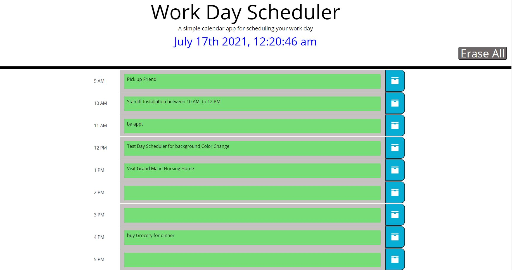

### Work Day Scheduler Starter Code

Client requested to generate daily planner that can manage work hours schedule time effectively. 

* Minimum requirements from the clients are as follow  : 

1.  When you open a daily planner, it will display the current calendar day at the top.
1.  When scrolled down, it presents time blocks for standard business hours from 9 am to 5 pm.
1.  Each time block is color coded indicating past (grey background), present (red background) and future (green background) task. 
1.  Upon clicking the time block, it allows you to enter an event.
1.  When clicking the save button on the right, the text for that event is saved in local storage
1.  when refreshing the page, the saved event will persist.

* Note: The Erase All button was added on the top right corner for User convenience so to erase all data at once and save time.

Reference Note : 
 * Instructor provided initial code to start with and build rest of the code to make it working per client requirement.
 
###### Below is the screenshot of the outcome when ran accordingly  

## Screenshots of the Project outcome ## 

[Please click here to deploy application](https://miraj00.github.io/work-day-scheduler/)

